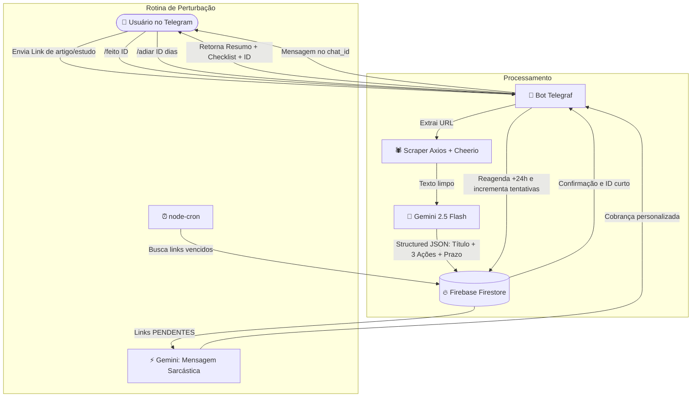

# 😈 Agiota de Ideias (Fiscal de Execução) 🤖📚
### Bot de Telegram com Node.js, TypeScript, Gemini 2.5 Flash e Firebase Firestore

> Um bot de cobrança implacável para quem sofre do "mal do acumulador de abas abertas". Envie links de artigos, posts ou vídeos, receba um resumo executivo com um checklist prático em 3 passos e sofra a cobrança do "Agiota" até executar ou pedir arrego!

---

## 🏗️ Arquitetura do Sistema



---

## 🚀 Tech Stack

- **Linguagem & Runtime:** Node.js (v20+) com TypeScript
- **Bot Framework:** `telegraf` (v4)
- **Inteligência Artificial:** `@google/genai` (Google Gen AI SDK com modelo `gemini-2.5-flash`)
- **Banco de Dados NoSQL:** `firebase-admin` (Cloud Firestore)
- **Web Scraping:** `axios` e `cheerio`
- **Agendamento Periódico:** `node-cron`
- **Variáveis de Ambiente:** `dotenv`
- **Dev Runner:** `tsx`

---

## 📁 Estrutura de Arquivos

```
Agiota de Ideias/
├── .env.example              # Modelo das variáveis de ambiente
├── .gitignore                # Ignora node_modules, dist, .env e credenciais
├── package.json              # Dependências e scripts npm
├── tsconfig.json             # Configuração TypeScript NodeNext
├── README.md                 # Documentação completa
├── scripts/
│   └── test-link.ts          # Script CLI para testar scraper + Gemini sem subir o bot
└── src/
    ├── index.ts              # Ponto de entrada (bootstrap, bot.launch, cron)
    ├── config/
    │   ├── env.ts            # Validação e exportação de variáveis de ambiente
    │   └── firebase.ts       # Inicialização do Firebase Admin SDK e Firestore
    ├── types/
    │   └── link.ts           # Tipagens (LinkDocument, GeminiAnalysis, Status)
    ├── services/
    │   ├── scraper.service.ts # Extração de conteúdo e texto da URL com axios/cheerio
    │   ├── gemini.service.ts  # Prompt estruturado (JSON Schema) e gerador de cobranças
    │   └── firestore.service.ts # Camada de dados do Firestore (CRUD, short_id, queries)
    ├── bot/
    │   ├── index.ts          # Instância do Telegraf, roteamento de texto e comandos
    │   ├── commands/
    │   │   ├── start.ts      # /start e /ajuda (boas-vindas e regras)
    │   │   ├── pendentes.ts  # /pendentes (lista dívidas ativas do usuário)
    │   │   ├── feito.ts      # /feito <id> (marca como concluído)
    │   │   └── adiar.ts      # /adiar <id> <dias> (prorroga prazo de cobrança)
    │   └── handlers/
    │       └── link.handler.ts # Interceptador de URLs, scraper, Gemini e persistência
    └── cron/
        └── cobranca.cron.ts  # Cron job para links vencidos com mensagens provocativas
```

---

## ⚙️ Pré-requisitos e Como Obter as Chaves

### 1. Token do Bot do Telegram
1. Abra o Telegram e procure por `@BotFather`.
2. Envie o comando `/newbot` e siga as instruções para definir o nome e o username do seu bot.
3. Copie o token de acesso HTTP da API gerado (ex: `123456789:ABCdefGhIJKlmNoPQRsTUVwxyZ`).

### 2. Chave de API do Google Gemini
1. Acesse o [Google AI Studio](https://aistudio.google.com/).
2. Clique em **Get API Key** e crie uma nova chave.
3. Copie o valor da sua API Key.

### 3. Credenciais do Firebase Firestore
1. Acesse o [Console do Firebase](https://console.firebase.google.com/).
2. Crie um projeto (ou selecione um existente).
3. No menu lateral, acesse **Criação** > **Firestore Database** e ative o banco de dados.
4. Vá em **Configurações do Projeto** (ícone de engrenagem) > **Contas de Serviço**.
5. Clique em **Gerar nova chave privada** e salve o arquivo como `serviceAccountKey.json` na raiz deste projeto.

---

## 📦 Instalação e Execução

### 1. Clonar ou Acessar a Pasta do Projeto
```bash
cd "Agiota de Ideias"
```

### 2. Instalar Dependências
```bash
npm install
```

### 3. Configurar o `.env`
Duplique o arquivo `.env.example` para `.env`:
```bash
cp .env.example .env
```
Preencha as variáveis no seu `.env`:
```env
TELEGRAM_BOT_TOKEN="seu_token_do_telegram"
GEMINI_API_KEY="sua_chave_do_gemini"
GEMINI_MODEL="gemini-2.5-flash"
CRON_SCHEDULE="0 * * * *"
FIREBASE_SERVICE_ACCOUNT_PATH="./serviceAccountKey.json"
```

> **Dica para testes rápidos de cobrança:** Altere temporariamente `CRON_SCHEDULE="*/2 * * * *"` para rodar a cada 2 minutos.

---

## 🧪 Testando o Scraping e o Gemini Isoladamente

Você pode testar se a extração de páginas web e a resposta estruturada do Gemini estão funcionando corretamente usando o script de teste incluído:

```bash
npm run test:link https://pt.wikipedia.org/wiki/Intelig%C3%AAncia_artificial
```

---

## 🏃 Iniciando o Bot

### Modo Desenvolvimento (Live Reload)
```bash
npm run dev
```

### Modo Produção (Compilado)
```bash
npm run build
npm start
```

---

## 🎮 Comandos do Bot no Telegram

| Comando | Descrição | Exemplo |
| :--- | :--- | :--- |
| `https://...` | Qualquer mensagem contendo um link é analisada pelo bot e gera o checklist. | `https://artigo.com/como-focar` |
| `/start` ou `/ajuda` | Mostra a mensagem de boas-vindas, tom do bot e instruções de uso. | `/start` |
| `/pendentes` | Lista todas as dívidas ativas do usuário, prazos e IDs curtos. | `/pendentes` |
| `/feito <id>` | Marca o link como concluído, cancelando cobranças futuras. | `/feito 9f2a1b` |
| `/adiar <id> <dias>` | Prorroga a data da próxima cobrança por X dias. | `/adiar 9f2a1b 2` |

---

## 🛡️ Tratamento de Erros e Boas Práticas

- **IDs Curtos Amigáveis:** Além do ID longo do Firestore, o bot gera identificadores curtos de 6 caracteres (ex: `9f2a1b`) para o usuário não precisar digitar hashes longos no celular.
- **Consultas Otimizadas no Firestore:** As buscas por usuário evitam exigir índices compostos manuais no Firestore logo na inicialização.
- **Rate-Limiting Seguro:** A rotina do Cron Job adiciona delays graduais entre os envios no Telegram para evitar rate-limits (HTTP 429).
- **Fallback Gracioso:** Se um site bloquear scraping via Cloudflare/Paywall, o Gemini recebe o título e a URL para ainda assim tentar formular um checklist prático ao usuário.
